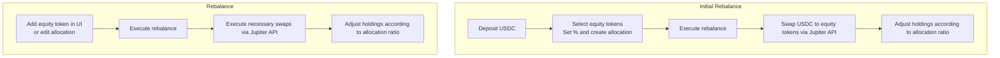

# Execution Flow

```mermaid
flowchart TD
  subgraph "Initial Rebalance"
    A1["Deposit USDC"] --> A2["Select equity tokens<br/>Set % and create allocation"]
    A2 --> A3["Execute rebalance"]
    A3 --> A4["Swap USDC to equity tokens via Jupiter API"]
    A4 --> A5["Adjust holdings according to allocation ratio"]
  end

  subgraph "Rebalance"
    B1["Add equity token in UI<br/>or edit allocation"] --> B2["Execute rebalance"]
    B2 --> B3["Execute necessary swaps via Jupiter API"]
    B3 --> B4["Adjust holdings according to allocation ratio"]
  end
```
