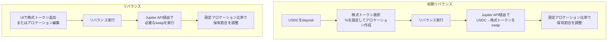

# 実行フロー

```mermaid
flowchart TD
  subgraph "初期リバランス"
    A1["USDCをdeposit"] --> A2["株式トークン選択<br/>%を設定してアロケーション作成"]
    A2 --> A3["リバランス実行"]
    A3 --> A4["Jupiter API経由で<br/>USDC→株式トークンをswap"]
    A4 --> A5["設定アロケーション比率で<br/>保有割合を調整"]
  end

  subgraph "リバランス"
    B1["UIで株式トークン追加<br/>またはアロケーション編集"] --> B2["リバランス実行"]
    B2 --> B3["Jupiter API経由で<br/>必要なswapを実行"]
    B3 --> B4["設定アロケーション比率で<br/>保有割合を調整"]
  end
```
